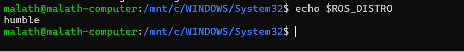

# ROS2-Humble-Installation


## Overview

This repository documents the installation steps for **ROS 2 Humble** on **Ubuntu 22.04 LTS (Jammy Jellyfish)**.

> **Note:** ROS 2 Humble is designed to run on **Ubuntu 22.04 LTS**, so Ubuntu 22.04 must be installed before starting the installation process.

---

## Installation Steps

### 1. Update the system

```bash
sudo apt update && sudo apt upgrade
```

### 2. Install required packages

```bash
sudo apt install software-properties-common curl
```

### 3. Add the ROS 2 GPG key

```bash
sudo curl -sSL https://raw.githubusercontent.com/ros/rosdistro/master/ros.key -o /usr/share/keyrings/ros-archive-keyring.gpg
```

### 4. Add the ROS 2 repository

```bash
echo "deb [arch=amd64 signed-by=/usr/share/keyrings/ros-archive-keyring.gpg] http://packages.ros.org/ros2/ubuntu jammy main" | sudo tee /etc/apt/sources.list.d/ros2.list > /dev/null
```

### 5. Update package list

```bash
sudo apt update
```

### 6. Install ROS 2 Humble Desktop

```bash
sudo apt install ros-humble-desktop
```

---

## Configure the Environment

```bash
echo "source /opt/ros/humble/setup.bash" >> ~/.bashrc
```

```bash
source ~/.bashrc
```

---

## Verify the Installation

Check the installed ROS 2 version:

```bash
ros2 --version
```

Check the ROS distribution:

```bash
echo $ROS_DISTRO
```

Expected output:

```text
humble
```

---

## Installation Screenshot
(humble.png)


> Add the installation screen

